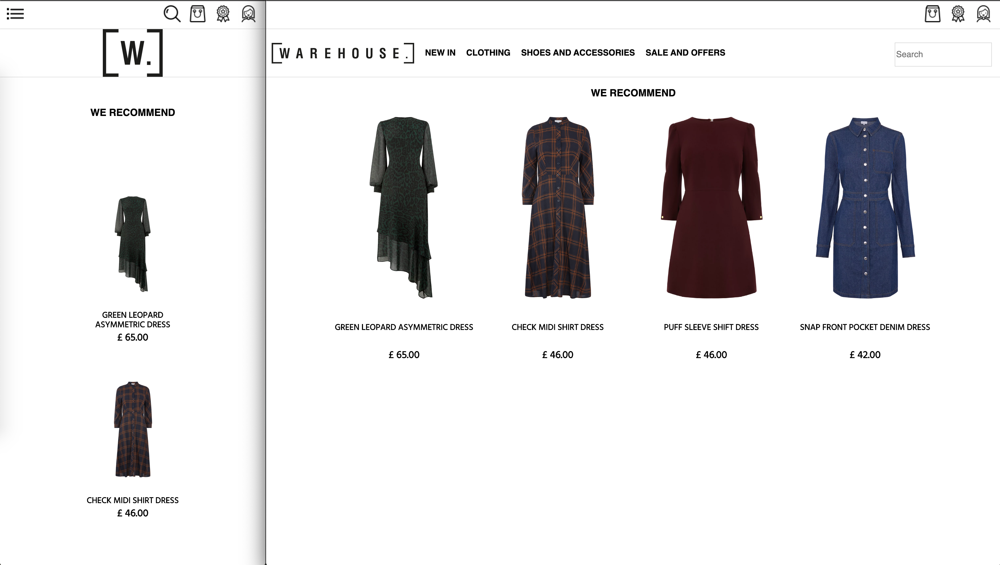
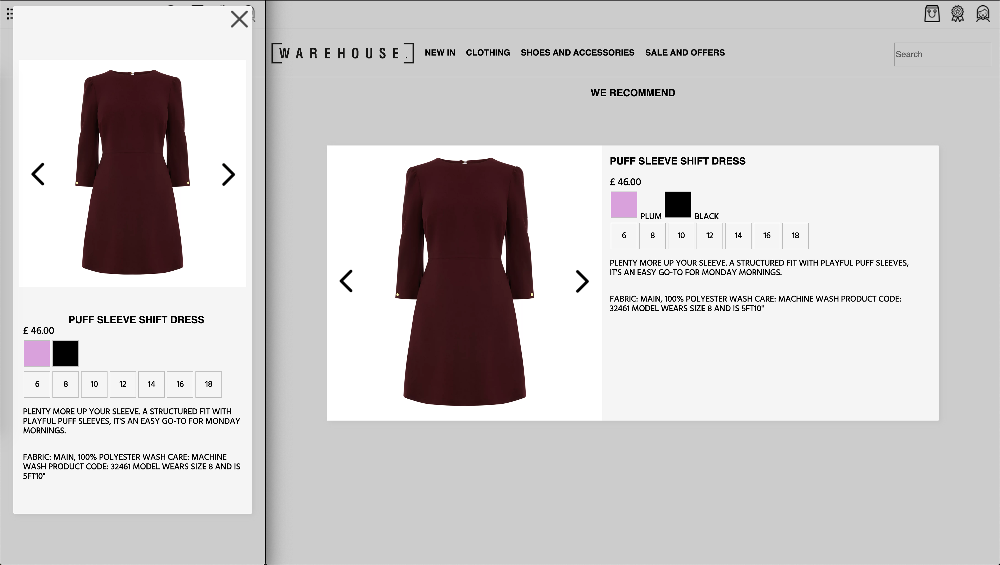

# Warehouse Software Engineer Exercise

## Breifing:
This website is built on the current version of React (16.7) and is purely a HTML(JSX), CSS(SASS) and JavaScript website.

Webpack is used to provide a dev-server environment.

As this project did not require any backend, no other services are running.

Most media is local, however some assets (brand logo) are remote, so for best results please maintain an internet connection while testing.

I've added a few icons and UI on the main site, without functionality, but instead to demonstrate an example of Desktop and Mobile views and how UI may change. I kept functionality out as this was not part of the breif and I was on a time limit.

## Instructions:
Having downloaded the repository please be sure to run 
`$ npm install` to install all packages from the package.json file.

No backend or express server is needed as JSON is loaded locally, simply run `$ npm run front` to start the webpack dev server once all node modules have completed installation.

I've configured webpack to run dev-server on port `4000`. Please make sure your port is not in use before initialising, or feel free to re-configure to a prefered port.

#### How should this website look?
This website has passed tests on Google Chrome, Safari Web on Mac OS and Safari Mobile on iOS.

Example of Mobile (left) and Desktop views (right)

## How to use this website:
The recommended products are mapped out in a horizontal scrolling (vertical for mobile) container.

Each product card is within a re-usable react component. Simply click on an image to load the product Lightbox for more information about the product.

The Lightbox is another re-usable React component, each component comes loaded with a pure react carousel, as well as a template to display data about each product.

Every colour variety in the Lightbox product view, when clicked, will update the carousel with the new data for the respective color, maintaining your position in the carousel, so you can compare the differences between each product color variety more accurately.

To exit the Lightbox, you can simply click away from it, or hit the Esc key. If you're in mobile view, there is an exit cross in the top right corner.

## Challenges
I really enjoyed this code challenge, at first I thought the task to be simple, but once I dug through the JSON data and saw what I had to play with, I managed to get my teeth sunk into a lot of preening at details.

I noticed a few discrepencies between the two JSON data files (`price`), so had to reconcile this data to ensure data was always populating my template. 

I also noticed that similar object values between the two JSON objects didn't hve respective paths/object keys (`product.name` vs `product_nam`e). It's details like this that kept me on my feet during the challenge.

My biggest challenge was really focussing on the mobile optimisation. It can be a fiddly job, and can take a fair amount of time to really iron out details to suit every single screen-size.

## Future Improvements
I would really have liked to spend more time on optimising this website for multiple displays. As much as everything currently adapts to web & mobile view, I didnt get a mobile-landscape/tablet media query in.

Also, I've worked hard to deliver functionality and stability in my code, but I could spend a lot more time refactoring my functions given more time.

I have really enjoyed building this site, given more time I would love to implement the search feature so I can re-use my Lightbox and Card components again and see if there's any more functionality I could add to the Lightbox - perhaps ablity to scroll through the next item, or even a compare product view.